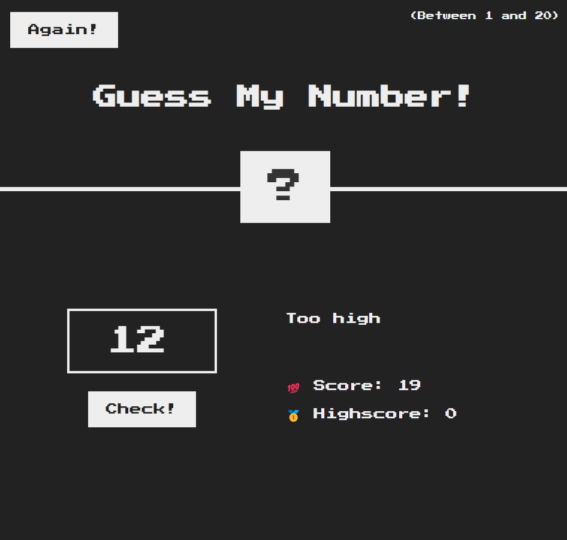

# Guess My Number Game

This is a simple number guessing game built with HTML, CSS, and JavaScript. The objective of the game is to guess the secret number between 1 and 20.

## How to Play:
1. Enter a number between 1 and 20 in the input field.
2. Click the "Check!" button to see if your guess is correct.
3. The game will provide feedback whether your guess is too high or too low.
4. Your score decreases with each incorrect guess.
5. Try to guess the number with the highest possible score!

## Features:
- Interactive user interface
- Score tracking
- Reset button to play again

## Screenshot:

## Getting Started:
To play the game, simply open the `index.html` file in your browser.

## License:
This project is licensed under the MIT License.
